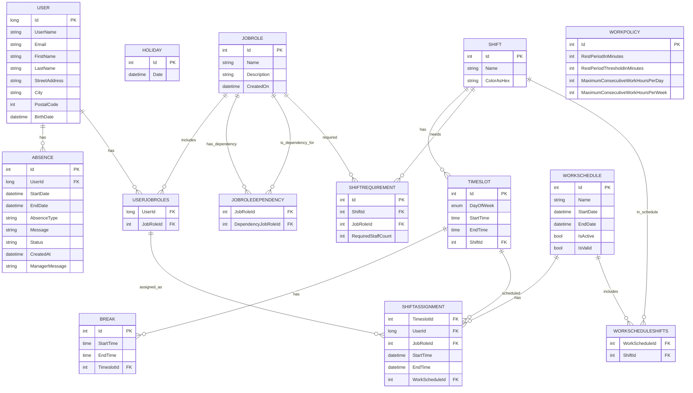

# Schichtpilot Entity Relationship Diagram (EF Core)

```mermaid
erDiagram
    USER {
        long Id PK
        string UserName
        string Email
        string FirstName
        string LastName
        string StreetAddress
        string City
        int PostalCode
        datetime BirthDate
    }

    ABSENCE {
        int Id PK
        long UserId FK
        datetime StartDate
        datetime EndDate
        string AbsenceType
        string Message
        string Status
        datetime CreatedAt
        string ManagerMessage
    }

    BREAK {
        int Id PK
        time StartTime
        time EndTime
        int TimeslotId FK
    }

    HOLIDAY {
        int Id PK
        datetime Date
    }

    JOBROLE {
        int Id PK
        string Name
        string Description
        datetime CreatedOn
    }

    JOBROLEDEPENDENCY {
        int JobRoleId FK
        int DependencyJobRoleId FK
    }

    SHIFT {
        int Id PK
        string Name
        string ColorAsHex
    }

    SHIFTREQUIREMENT {
        int Id PK
        int ShiftId FK
        int JobRoleId FK
        int RequiredStaffCount
    }

    TIMESLOT {
        int Id PK
        enum DayOfWeek
        time StartTime
        time EndTime
        int ShiftId FK
    }

    USERJOBROLES {
        long UserId FK
        int JobRoleId FK
    }

    SHIFTASSIGNMENT {
        int TimeslotId FK
        long UserId FK
        int JobRoleId FK
        datetime StartTime
        datetime EndTime
        int WorkScheduleId FK
    }

    WORKPOLICY {
        int Id PK
        int RestPeriodInMinutes
        int RestPeriodThresholdInMinutes
        int MaximumConsecutiveWorkHoursPerDay
        int MaximumConsecutiveWorkHoursPerWeek
    }

    WORKSCHEDULE {
        int Id PK
        string Name
        datetime StartDate
        datetime EndDate
        bool IsActive
        bool IsValid
    }

    WORKSCHEDULESHIFTS {
        int WorkScheduleId FK
        int ShiftId FK
    }

    USER ||--o{ ABSENCE : has
    USER ||--o{ USERJOBROLES : has
    JOBROLE ||--o{ USERJOBROLES : includes

    JOBROLE ||--o{ JOBROLEDEPENDENCY : has_dependency
    JOBROLE ||--o{ JOBROLEDEPENDENCY : is_dependency_for

    SHIFT ||--o{ TIMESLOT : has
    TIMESLOT ||--o{ BREAK : has

    SHIFT ||--o{ SHIFTREQUIREMENT : needs
    JOBROLE ||--o{ SHIFTREQUIREMENT : required

    WORKSCHEDULE ||--o{ SHIFTASSIGNMENT : has
    TIMESLOT ||--o{ SHIFTASSIGNMENT : scheduled
    USERJOBROLES ||--o{ SHIFTASSIGNMENT : assigned_as

    WORKSCHEDULE ||--o{ WORKSCHEDULESHIFTS : includes
    SHIFT ||--o{ WORKSCHEDULESHIFTS : in_schedule
```