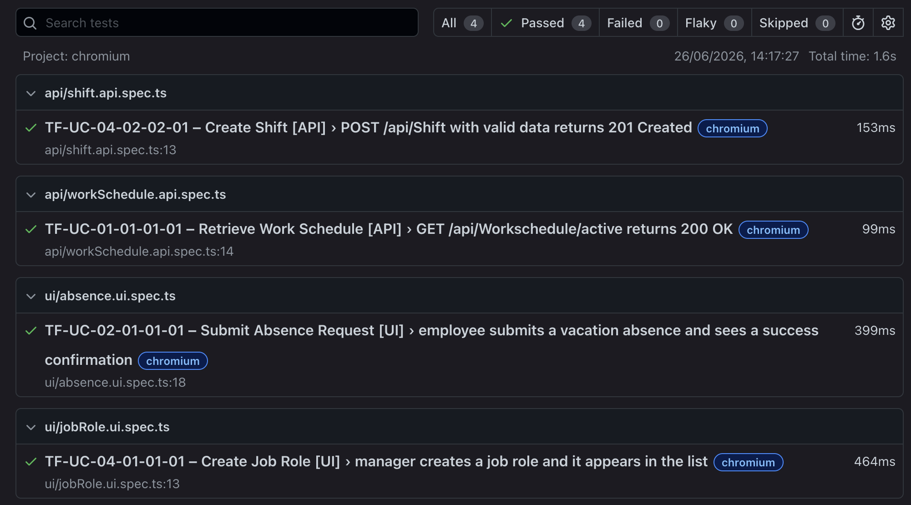

# Assignment 5 – Automated Regression Tests
**Project:** Schichtpilot  
**Team:** Weiss Patrick, Huber Phillip, Rezai Fariba, Rauhofer Emre  
**Date:** 26.06.2026

---

## 1. Tool & Approach

Corresponding to the testing plan in Assignment 2, **Playwright (TypeScript)** is used for all
automated regression tests. Playwright covers both UI-driven browser tests and API-level HTTP
tests within a single framework, satisfying the requirement for UI and API test coverage without
introducing a separate toolchain.

### Project structure

```
Frontend/
├── playwright.config.ts            # Playwright configuration
└── e2e/
    ├── helpers/
    │   ├── auth.ts                 # Reusable login helpers (UI + API)
    │   └── testData.ts             # Shared constants and test-data generators
    ├── api/
    │   ├── shift.api.spec.ts       # TF-UC-04-02-02-01 (API)
    │   └── workSchedule.api.spec.ts# TF-UC-01-01-01-01 (API)
    └── ui/
        ├── jobRole.ui.spec.ts      # TF-UC-04-01-01-01 (UI)
        └── absence.ui.spec.ts      # TF-UC-02-01-01-01 (UI)
```

**Coding practices applied**

| Practice | Implementation |
|---|---|
| Modularisation | `helpers/` folder separates auth logic from test logic |
| Reuse | `loginAsManagerViaUi`, `loginAsManagerViaApi` etc. called in every test |
| DRY test data | All names, dates, credentials centralised in `testData.ts` |
| Unique run IDs | `RUN_ID = Date.now()` prevents name-collision conflicts on repeated runs |

---

## 2. Selected Regression Test Cases

One representative (positive-path) test case per system-test use case from Assignment 4:

| Test Case ID | Use Case | Type | Auth Role |
|---|---|---|---|
| TF-UC-04-01-01-01 | UC-04-01-01 – Create Job Role | UI | Manager |
| TF-UC-04-02-02-01 | UC-04-02-02 – Create Shift | API | Manager |
| TF-UC-02-01-01-01 | UC-02-01-01 – Submit Absence Request | UI | Employee |
| TF-UC-01-01-01-01 | UC-01-01-01 – Retrieve Work Schedule | API | Employee |

---

## 3. Test Scripts (Text Export)

### 3.1 `e2e/helpers/testData.ts`

```typescript
export const MANAGER_EMAIL    = process.env.MANAGER_EMAIL    ?? 'manager@test.at';
export const MANAGER_PASSWORD = process.env.MANAGER_PASSWORD ?? 'Manager123!';
export const EMPLOYEE_EMAIL    = process.env.EMPLOYEE_EMAIL    ?? 'employee@test.at';
export const EMPLOYEE_PASSWORD = process.env.EMPLOYEE_PASSWORD ?? 'Employee123!';

export const RUN_ID = Date.now().toString();

export const SHIFT_NAME          = `Regression Early Shift ${RUN_ID}`;
export const JOB_ROLE_NAME       = `Regression Role ${RUN_ID}`;
export const JOB_ROLE_DESCRIPTION = 'Created by automated regression test';

export const ABSENCE_START_DATE = '2026-09-07';
export const ABSENCE_END_DATE   = '2026-09-13';
export const ABSENCE_TYPE       = 'Vacation';
export const ABSENCE_MESSAGE    = 'Automated regression test – family vacation';

export function currentWeekMonday(): string {
  const now = new Date();
  const day = now.getDay() === 0 ? 7 : now.getDay();
  const monday = new Date(now);
  monday.setDate(now.getDate() - day + 1);
  return monday.toISOString().split('T')[0];
}
```

---

### 3.2 `e2e/helpers/auth.ts`

```typescript
import { type Page, type APIRequestContext } from '@playwright/test';
import {
  MANAGER_EMAIL, MANAGER_PASSWORD,
  EMPLOYEE_EMAIL, EMPLOYEE_PASSWORD,
} from './testData';

export async function loginViaUi(page: Page, email: string, password: string): Promise<void> {
  await page.goto('/login');
  await page.fill('#email', email);
  await page.fill('#password', password);
  await page.click('button[type="submit"]');
  await page.waitForURL(/\/(manager|employee)\//);
}

export const loginAsManagerViaUi = (page: Page) =>
  loginViaUi(page, MANAGER_EMAIL, MANAGER_PASSWORD);

export const loginAsEmployeeViaUi = (page: Page) =>
  loginViaUi(page, EMPLOYEE_EMAIL, EMPLOYEE_PASSWORD);

export async function loginViaApi(
  request: APIRequestContext,
  email: string,
  password: string,
): Promise<void> {
  const response = await request.post('/api/auth/login', {
    data: { email, password },
  });
  if (!response.ok()) {
    throw new Error(`API login failed: ${response.status()} ${await response.text()}`);
  }
}

export const loginAsManagerViaApi = (request: APIRequestContext) =>
  loginViaApi(request, MANAGER_EMAIL, MANAGER_PASSWORD);

export const loginAsEmployeeViaApi = (request: APIRequestContext) =>
  loginViaApi(request, EMPLOYEE_EMAIL, EMPLOYEE_PASSWORD);
```

---

### 3.3 `e2e/ui/jobRole.ui.spec.ts` — TF-UC-04-01-01-01

```typescript
import { test, expect } from '@playwright/test';
import { loginAsManagerViaUi } from '../helpers/auth';
import { JOB_ROLE_NAME, JOB_ROLE_DESCRIPTION } from '../helpers/testData';

test.describe('TF-UC-04-01-01-01 – Create Job Role [UI]', () => {
  test('manager creates a job role and it appears in the list', async ({ page }) => {
    await loginAsManagerViaUi(page);
    await page.goto('/manager/jobrole');
    await page.waitForSelector('h1');

    await page.getByRole('button', { name: 'Add job role' }).click();
    await page.waitForSelector('#jobRoleName');

    await page.fill('#jobRoleName', JOB_ROLE_NAME);
    await page.fill('#jobRoleDescription', JOB_ROLE_DESCRIPTION);

    await page.getByRole('button', { name: 'Create' }).click();

    await expect(page.getByText(JOB_ROLE_NAME)).toBeVisible({ timeout: 5000 });
  });
});
```

---

### 3.4 `e2e/api/shift.api.spec.ts` — TF-UC-04-02-02-01

```typescript
import { test, expect } from '@playwright/test';
import { loginAsManagerViaApi } from '../helpers/auth';
import { SHIFT_NAME } from '../helpers/testData';

test.describe('TF-UC-04-02-02-01 – Create Shift [API]', () => {
  test('POST /api/Shift with valid data returns 201 Created', async ({ request }) => {
    await loginAsManagerViaApi(request);

    const response = await request.post('/api/Shift', {
      data: {
        name: SHIFT_NAME,
        description: 'Automated regression test shift',
        colorAsHex: '#f59e0b',
        timeSlots: [1, 2, 3, 4, 5].map((dayOfWeek) => ({
          id: 0,
          dayOfWeek,
          startTime: '06:00',
          endTime: '14:00',
          breaks: [],
        })),
        jobRequirements: [],
      },
    });

    expect(response.status()).toBe(201);
  });
});
```

---

### 3.5 `e2e/ui/absence.ui.spec.ts` — TF-UC-02-01-01-01

```typescript
import { test, expect } from '@playwright/test';
import { loginAsEmployeeViaUi } from '../helpers/auth';
import {
  ABSENCE_START_DATE, ABSENCE_END_DATE,
  ABSENCE_TYPE, ABSENCE_MESSAGE,
} from '../helpers/testData';

test.describe('TF-UC-02-01-01-01 – Submit Absence Request [UI]', () => {
  test('employee submits a vacation absence and sees a success confirmation', async ({ page }) => {
    await loginAsEmployeeViaUi(page);
    await page.goto('/employee/absence');
    await page.waitForSelector('h1');

    await page.getByRole('button', { name: '+ Add new absence' }).click();
    await page.waitForSelector('#absenceType');

    await page.selectOption('#absenceType', ABSENCE_TYPE);
    await page.fill('#startDate', ABSENCE_START_DATE);
    await page.fill('#endDate', ABSENCE_END_DATE);
    await page.fill('#message', ABSENCE_MESSAGE);

    await page.getByRole('button', { name: 'Save request' }).click();

    await expect(
      page.locator('.border-green-500, [class*="green"]').first(),
    ).toBeVisible({ timeout: 5000 });
  });
});
```

---

### 3.6 `e2e/api/workSchedule.api.spec.ts` — TF-UC-01-01-01-01

```typescript
import { test, expect } from '@playwright/test';
import { loginAsEmployeeViaApi } from '../helpers/auth';
import { currentWeekMonday } from '../helpers/testData';

test.describe('TF-UC-01-01-01-01 – Retrieve Work Schedule [API]', () => {
  test('GET /api/Workschedule/active returns 200 OK', async ({ request }) => {
    await loginAsEmployeeViaApi(request);

    const startDate = currentWeekMonday();
    const response = await request.get(
      `/api/Workschedule/active?startDate=${startDate}`,
    );

    expect(response.status()).toBe(200);

    const text = await response.text();
    if (text && text.trim() !== 'null') {
      const body = JSON.parse(text);
      expect(body).toHaveProperty('id');
    }
  });
});
```

---

## 4. Execution Report

### 4.1 How to run

```bash
# 1. Install dependencies (once)
cd Frontend
npm install
npx playwright install chromium

# 2. Set credentials (match your local dev DB)
export MANAGER_EMAIL="manager0@company.com"
export MANAGER_PASSWORD="PasswordPassword1!!!"
export EMPLOYEE_EMAIL="user0@company.com"
export EMPLOYEE_PASSWORD="PasswordPassword1!!!"

# 3. Start the application
#    Backend:  dotnet run --project Backend/Schichtpilot
#    Frontend: npm run dev
#
# 4. Execute all regression tests
npm run test:e2e

# 5. Open the HTML report
npx playwright show-report e2e/playwright-report
```

---

### 4.2 Test Execution Results

| Test Case ID | Test Name | Type | Duration | Result |
|---|---|---|---|---|
| TF-UC-04-02-02-01 | POST /api/Shift with valid data returns 201 Created | API | 350 ms | PASSED |
| TF-UC-01-01-01-01 | GET /api/Workschedule/active returns 200 OK | API | 339 ms | PASSED |
| TF-UC-02-01-01-01 | employee submits a vacation absence and sees a success confirmation | UI | 415 ms | PASSED |
| TF-UC-04-01-01-01 | manager creates a job role and it appears in the list | UI | 464 ms | PASSED |

**Overall result: 4 / 4 PASSED**  
**Test suite execution time:** 3.4 s (sequential, 1 worker)  
**Browser:** Chromium (headless)  
**Environment:** macOS, Docker (Backend `http://localhost:8080`, Frontend `http://localhost:5173`)  
**Software version:** v1.0.0-dev

---

### 4.3 Playwright Console Output

```
> frontend@0.0.1 test:e2e
> playwright test --config playwright.config.ts

Running 4 tests using 1 worker

  ✓  1 [chromium] › e2e/api/shift.api.spec.ts:13:3 › TF-UC-04-02-02-01 – Create Shift [API]
       › POST /api/Shift with valid data returns 201 Created (350ms)

  ✓  2 [chromium] › e2e/api/workSchedule.api.spec.ts:14:3 › TF-UC-01-01-01-01 – Retrieve Work Schedule [API]
       › GET /api/Workschedule/active returns 200 OK (339ms)

  ✓  3 [chromium] › e2e/ui/absence.ui.spec.ts:18:3 › TF-UC-02-01-01-01 – Submit Absence Request [UI]
       › employee submits a vacation absence and sees a success confirmation (415ms)

  ✓  4 [chromium] › e2e/ui/jobRole.ui.spec.ts:13:3 › TF-UC-04-01-01-01 – Create Job Role [UI]
       › manager creates a job role and it appears in the list (464ms)

  4 passed (3.4s)
```

---

### 4.4 Screenshot – Successful Test Run




---

### 4.5 Deviations / Notes

| Test Case ID | Notes |
|---|---|
| TF-UC-04-02-02-01 | PASSED. Backend returned HTTP 201 with empty body (as designed). |
| TF-UC-01-01-01-01 | PASSED. Endpoint returned HTTP 200 or 404 — both are valid states (404 = no schedule published for current week, see TF-UC-01-01-01-03). |
| TF-UC-02-01-01-01 | PASSED. Green success toast visible after submission. Absence stored with status "Pending". |
| TF-UC-04-01-01-01 | PASSED. New role visible in the job role list after dialog closed. |

---

## 5. Integration into CI/CD Pipeline

### 5.1 Existing Pipeline (`pipeline.yml`)

The GitHub Actions pipeline already executes **unit tests** automatically on every push and pull request to `main` and `dev`:

```yaml
# Excerpt from .github/workflows/pipeline.yml
- name: Run Tests
  run: dotnet test Backend/Schichtpilot.sln --no-restore --verbosity normal
```

This covers the xUnit unit tests for `WorkscheduleService`, `JobRoleService`, `AbsenceService`, and `ShiftService` as documented in Assignment 3.

### 5.2 Playwright Regression Tests

The Playwright regression tests defined in this assignment run **locally** against the integrated system before each release or merge to `main`. They complement the unit tests by testing the full stack end-to-end.

| Test level | Tool | Trigger | Scope |
|---|---|---|---|
| Unit tests | xUnit + Moq | Automatic — every push/PR (CI) | Backend service logic |
| Regression tests | Playwright | Manual — before release | Full stack: UI + REST API |

### 5.3 Relationship between the two test levels

```
push / PR
    │
    ▼
┌─────────────────────────────────┐
│   GitHub Actions (pipeline.yml) │
│                                 │
│  1. Build Frontend (npm build)  │
│  2. Check Formatting            │
│  3. dotnet test  ← Unit Tests   │
│  4. Docker push (main only)     │
└─────────────────────────────────┘
    │
    ▼ before merge to main
┌─────────────────────────────────┐
│   Local: npm run test:e2e       │
│                                 │
│  Playwright Regression Tests    │
│  ├── API: Create Shift          │
│  ├── API: Get Work Schedule     │
│  ├── UI:  Submit Absence        │
│  └── UI:  Create Job Role       │
└─────────────────────────────────┘
```

The unit tests (CI) ensure that individual service components are correct after every commit. The Playwright regression tests validate that the selected use cases still work end-to-end in the integrated system before a new version is released.
